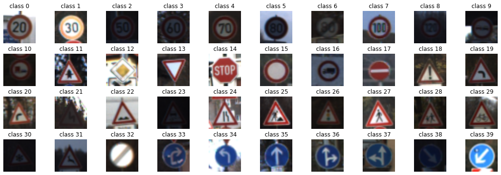
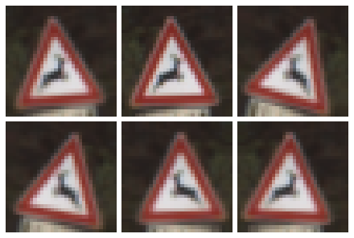
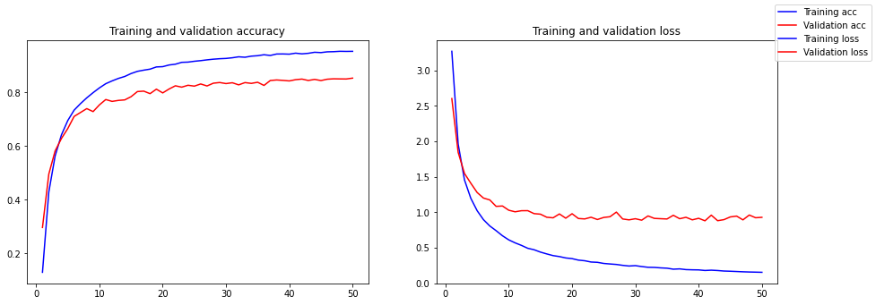
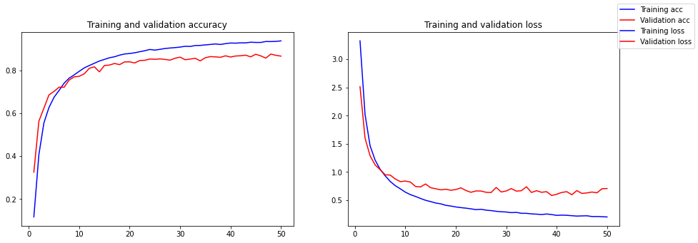
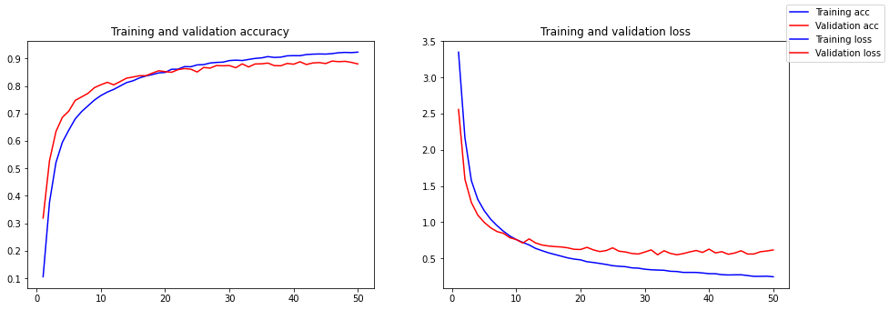
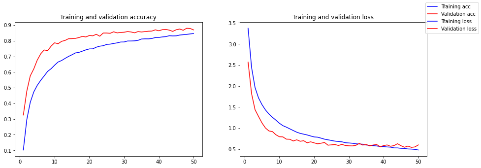
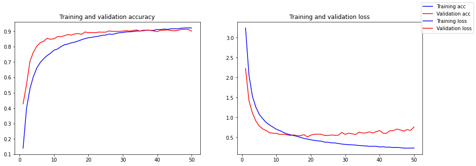

# Project: Build a Traffic Sign Recognition Program

 

## Contents

1. [Introdution](#introdution)
2. [The Model](#the-model)
3. [Result](#result)
4. [Challenges](#challenges)
5. [Conclusion](#conclusion)
6. [Refernces](#refernces)

---

## Introdution

In this project, you will use what you've learned about deep neural networks and convolutional neural networks to classify traffic signs. You will train and validate a model so it can classify traffic sign images using the German Traffic Sign Dataset [1][1]. After the model is trained, you will then try out your model on images of German traffic signs that you find on the web.

---

## Dataset

The next figure show one sample from every class.

The used data is a german traffic signs dataset. It consists of colour images.  The resolution of the image is 32x32. The training data set is 34799 image. The testing is 4410 image and the validation is 12630 image. The dataset is a 42 class.
We will use data augmentation. It will be using random rotation and horizontal flip.

---

## The Model

| Layer | Type | Kernal | Features | Activation |
|:-:|:-:|:-:|:-:|:-:|
| Input | | 32x32 |
| C1 | Convolution | 5x5 | 6 | tanh |
| S2 | Sub-sampling | 2x2 | | |
| C3 | Convolution | 5x5 | 16 | tanh |
| S4 | Sub-sampling | 5x5 |
| C5 | Convolution | 5x5 | 120 | tanh |
| F6 | Fully Connected | | 84 | tanh |
| F7 | Fully Connected | | 10 | | Softmax |

I am using a LeNet-5 model[2][2]. It was created by Yann LeCun in 1989. It was created for handwriting digits. As in figure 1, It's consists of seven layers. Three convolution layers, two pooling layers and two fully connected layers.
The modifications I proposed are
1. replacing the activation layer from `tanh` to `relu`.
2. `adam` optimizer inside of `SGD`.
3. I am using max polling inside of average polling.
4. Adding Dropout after `F6` for prevent overfiting. [3][3]
I am using an early stop technique which prevents the model from continuing training if the loss getting higher.

I started with 30 epoc then increase it 50 epoc.

---

## Result

After 50 epoc without agumentation and with 0.75 dropout. evalution accuracy is 92.9% and the loss value is 0.35.
I also used google map to starting this location [4][4] in A95, Munich, Bavaria, Germany to search for reallive traffic signs to test my model. The accuracy for this new image is 0%.
***This values was tested on agument data 20 random rotationa and horizontal flip.***

Follwoing table is some graphs for LeNet with diffrent presets I traied.

| | |
|:-:|:-:|
| without dropout |  |
| with 25 dropout |  |
| with 50 dropout |  |
| with 75 dropout |  |
| No agument with 25 dropout |  |

---

## Challenges

The model overfits after 30 epoch. I tried to use Dropout with different value 0.25, 0.5 and 0.75 values. It helps the system to get better accuracy.
***This values was tested on agument data 20 random rotationa and horizontal flip except the last row.***

| # | Dropout | accuracy(%) | loss |
|:-:|:-:|:-:|:-:|
| 1 | Without | 87 | 0.69 |
| 2 | 0.25 | 87.9 | 0.56|
| 3 | 0.50 | 89 | 0.47 |
| 4 | 0.75 | 88.2 | 0.36 |
| 4 | 0.75 & NoAgument | 92.9| 0.354 |

---

## Conclusion

LeNet is a simple model. I give excellent accuracy which can be achieved with training from scratch. It can be trained on non-enterprise GPUs or trained on CPU with decent runtime. Vanilla implemenation without Agmentation gives the best accuracy and loss too.

---

## References

1. https://benchmark.ini.rub.de/
2. https://direct.mit.edu/neco/article/1/4/541/5515/Backpropagation-Applied-to-Handwritten-Zip-Code
3. https://www.cs.toronto.edu/~rsalakhu/papers/srivastava14a.pdf

[1]: https://benchmark.ini.rub.de/
[2]: https://direct.mit.edu/neco/article/1/4/541/5515/Backpropagation-Applied-to-Handwritten-Zip-Code
[3]: https://www.cs.toronto.edu/~rsalakhu/papers/srivastava14a.pdf
